# Introdução

Este projeto foi desenvolvido para resolver a necessidade da **John Deere** de melhorar o gerenciamento e a localização de carrinhos em suas plataformas industriais. A principal dor enfrentada é a falta de controle preciso em tempo real da posição dos carrinhos, resultando em ineficiências operacionais, atrasos nas entregas de componentes e, consequentemente, aumento nos custos.

O objetivo deste projeto é implementar uma solução baseada em **IoT**, utilizando dispositivos **ESP32**, que permitirá a localização precisa dos carrinhos dentro das instalações. Essa solução busca otimizar o fluxo logístico, melhorar o gerenciamento de recursos e garantir que os carrinhos possam ser localizados de forma rápida e eficiente por meio de uma interface mobile.

# Desenvolvimento

O projeto de gestão de fluxo de transporte de peças em um ambiente de produção será desenvolvido em seis etapas. Na primeira etapa, será feito o planejamento e definição dos requisitos do sistema, especificando as funcionalidades, componentes de hardware e software necessários, e estabelecendo critérios de sucesso e metas do projeto. Um cronograma detalhado será criado, definindo as responsabilidades da equipe e alocando recursos e orçamento. <br><br>
Na segunda etapa, será realizado o design de hardware, incluindo a seleção de componentes como o modelo do ESP32, sensores de disponibilidade, LEDs e resistores, além do sistema de alimentação. Um esquema eletrônico detalhado será criado. A terceira etapa envolve o design de software, com desenvolvimento do firmware para o ESP32, configuração inicial, leitura dos sensores e comunicação Wi-Fi com o servidor central. Também será desenvolvida a aplicação mobile, focando no design da interface do usuário, implementação de funcionalidades principais e testes de usabilidade, além da configuração do servidor central e implementação da API de comunicação.<br><br>
A quarta etapa é a prototipagem e integração, onde será montado o protótipo de hardware do carrinho de transporte, seguido por testes iniciais de conexão e funcionamento dos componentes. A integração de hardware e software será realizada, com testes de comunicação e integração entre a aplicação mobile e o servidor central, além de testes dos algoritmos de triangulação Wi-Fi para localização dos carrinhos. Na quinta etapa, serão realizados testes e validação, incluindo testes individuais de cada componente, testes de integração em ambiente controlado, testes de campo no ambiente de produção real e ajustes baseados no feedback dos operadores.<br><br>
Na sexta e última etapa, será feita a documentação e treinamento, incluindo a criação de documentação detalhada para hardware e software, manuais de usuário para a aplicação mobile e procedimentos de manutenção do sistema. Esta abordagem estruturada garantirá que todas as fases do projeto sejam cuidadosamente planejadas, implementadas e testadas, assegurando o sucesso e a eficácia do sistema proposto.

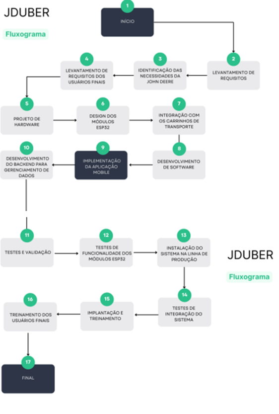

## Arquitetura

A solução proposta é baseada em uma arquitetura IoT que envolve os seguintes elementos:

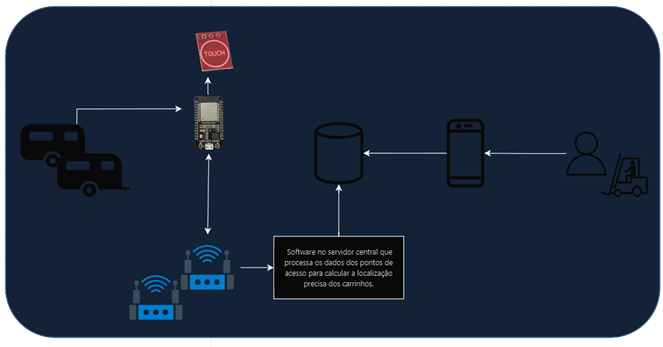

- **ESP32 Tags**: Dispositivos móveis que são colocados nos carrinhos. Eles enviam sinais Wi-Fi e Bluetooth para calcular a posição.
- **ESP32 Âncoras**: Dispositivos fixos que servem como pontos de referência para calcular a localização dos ESP32 Tags por meio de triangulação de sinais.
- **Roteadores Wi-Fi**: Conectam os dispositivos e transmitem os dados coletados para o servidor.
- **Gateway (ESP32 ou servidor dedicado)**: Coleta os dados dos ESP32 Tags e Âncoras, e os envia para a plataforma de análise na nuvem.
- **Plataforma de Análise de Dados (Nuvem)**: Armazena e processa os dados de localização, fornecendo resultados em tempo real.
- **Aplicação Mobile**: Interface gráfica onde os operadores podem visualizar a localização dos carrinhos e gerenciar suas rotas de entrega.
- 
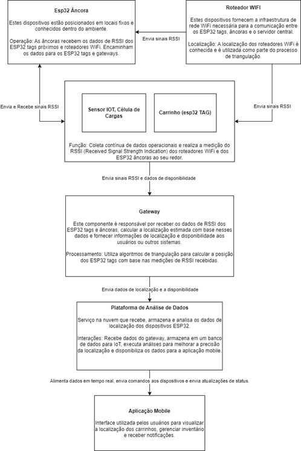

## Funcionamento e Tecnologias Envolvidas

- **ESP32**: Utiliza triangulação de sinais Wi-Fi e Bluetooth para calcular a localização. A biblioteca **Arduino** foi utilizada para a programação desses dispositivos.
- **Wi-Fi**: Utilizado para conectar os dispositivos e transferir os dados para o gateway.
- **Nuvem**: Os dados são enviados para uma plataforma em nuvem que utiliza **banco de dados MySQL** para armazenar as localizações dos carrinhos.
- **Mapbox GL JS**: Foi utilizado para visualização das localizações dos carrinhos em uma planta interna, permitindo a delimitação de caminhos e pontos de referência.
- **Mobile App**: Desenvolvido em **Java**, permite ao usuário monitorar a localização dos carrinhos e gerenciar suas rotas.

### Resultados Esperados

- **Precisão**: Espera-se que o sistema tenha uma precisão de localização que permita rastrear os carrinhos dentro da planta industrial com margem de erro reduzida.
- **Monitoramento em Tempo Real**: A aplicação deve fornecer atualizações em tempo real da posição dos carrinhos, melhorando o fluxo de trabalho.
- **Eficiência Operacional**: Redução no tempo de busca pelos carrinhos, resultando em maior eficiência e produtividade nas operações.

# Resultados

O projeto entregou uma aplicação funcional que realiza a localização dos carrinhos dentro da planta da John Deere. A seguir estão os principais resultados:

1. **Localização em Tempo Real**: A interface mobile exibe a posição dos carrinhos em um mapa, com atualizações em tempo real.

   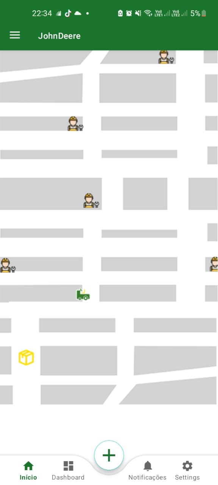

2. **Gerenciamento de Rotas**: A aplicação permite que o operador visualize as rotas de coleta e entrega diretamente pela interface, simplificando o processo logístico.

   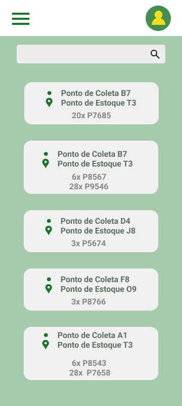

   Tela do Operador:

   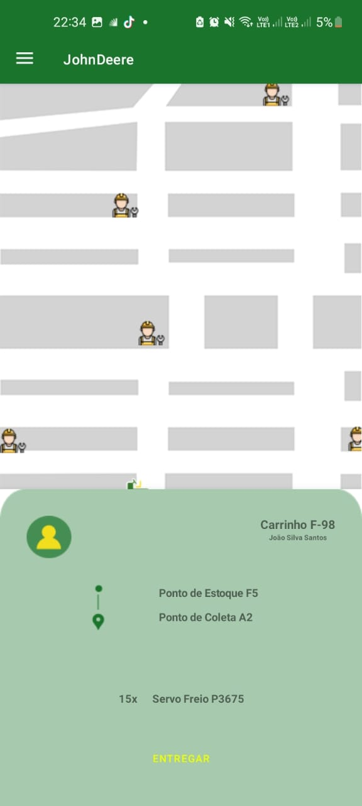

   Tela do Gerente:

   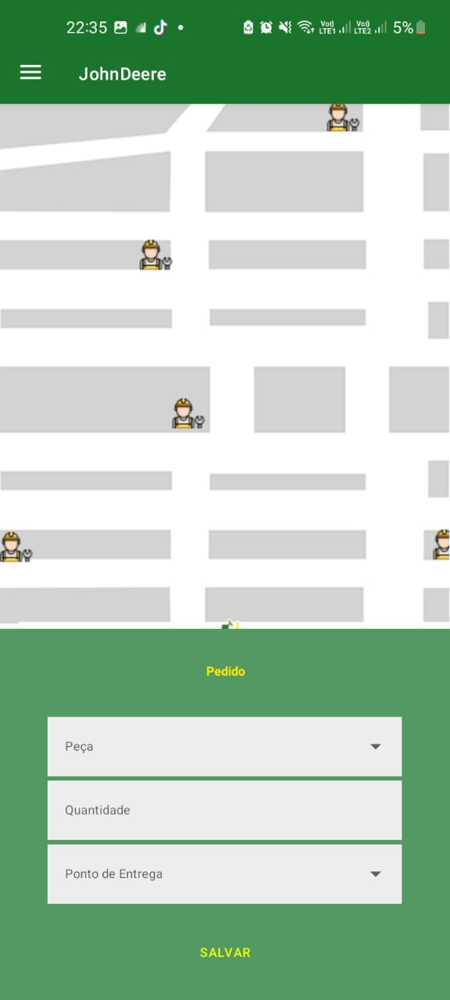

   Outras:

   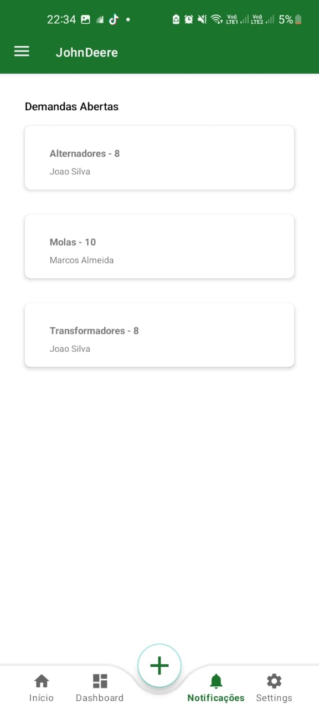


   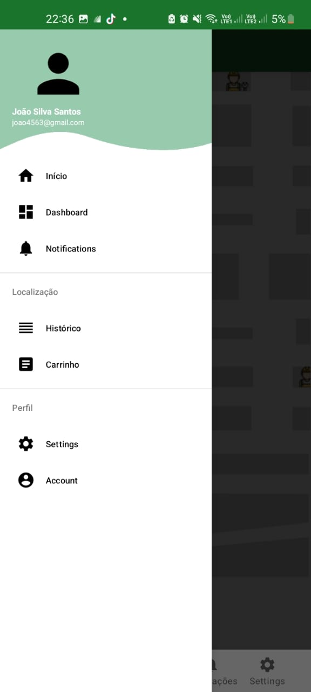

   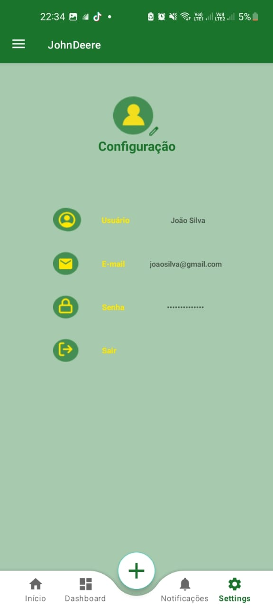


Esses resultados mostram que a solução IoT foi bem-sucedida em atender aos objetivos do projeto, otimizando o processo de gerenciamento dos carrinhos na plataforma industrial da John Deere.

## Testes de Desempenho

### Teste de Precisão de Localização

#### Definição da Ferramenta de Teste
Para o teste de precisão de localização, usaremos a aplicação final e os valores reais para fazer uma comparação dos valores e assim obter dados. Basicamente calibramos os RSSi de referencia de cada ponto de acesso, colocamos em lugares conhecidos para delimitar as localizações e os RSSi de ref para a API fazer os calculos. Depois desenhamos um mapa para ilustrar a localização real do teste e medimos a sua localização exata. Depois so comparar os valores.

#### Evidências de Testes

Todos os valores estão em metros, a imagem tem 3,60 a 6,33 metros essas estimativas foram inseridas no código. A imagem não representa tamanho reais sobre o teste.
Vídeo Aplicação Rodando no gif abaixo ou no link [video](https://youtube.com/shorts/-aIpXpkqsmc?feature=share) no youtube

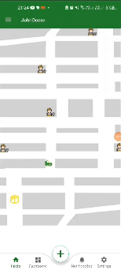


Representação dos dados reais, os marcadores azuis representam os pontos de acesso (roteadores), cada um deles tem localizações conhecidas e possuem medições de referência do RSSI para conseguir determinar a localização do esp.

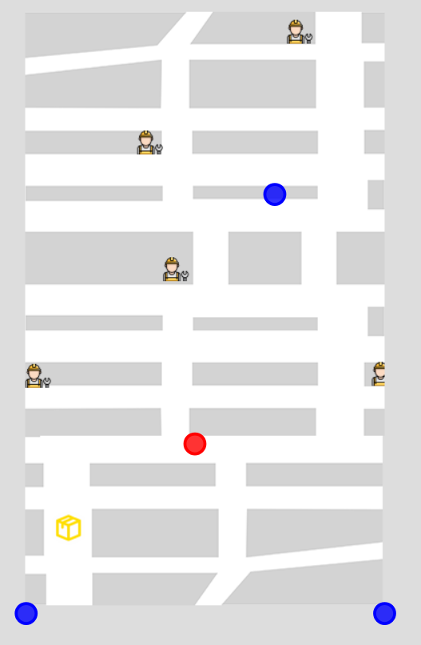
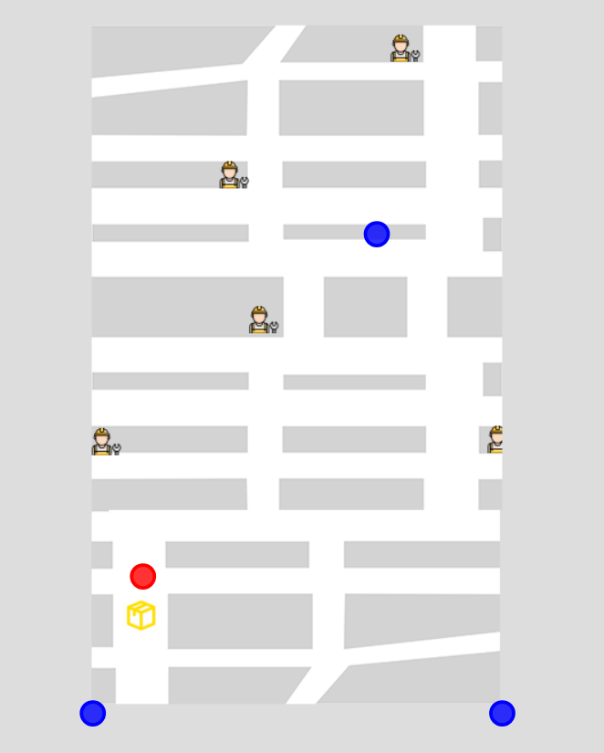


Fotos reais dos testes:

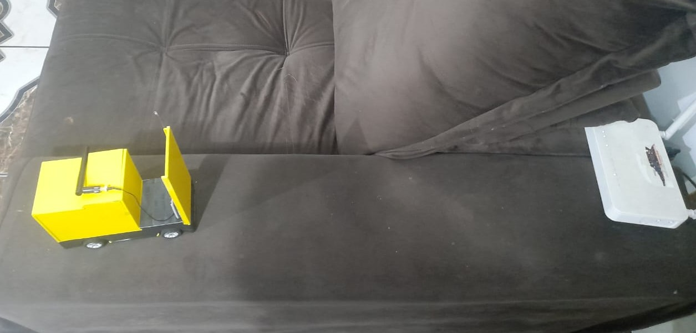


- Exemplo:
  - **Local Final** (Coordenadas Reais: x = 0.56, y = 2.41) — Coordenadas Coletadas: x = 1.42, y = 1.86 — **Erro**: 0.705 m na média

#### Discussão dos Resultados
Os resultados mostram uma variação de precisão média de 0.7 metros, indicando que o sistema de triangulação consegue localizar o ESP32 com boa precisão em áreas sem interferência. Em locais com interferência e com poucos rotedores a precisão diminiu drasticamente, e depedendo da distância média que os roteadores ficaram um do outro, porque a precisão diminui com base na distância pois a perda de potência por vezes não é apenas proporcinal a distância, mas também a obstaculos e outros aparelhos simutaneos.

#### Soluções Futuras
- Implementar técnicas de calibração dinâmica de RSSI para melhorar a precisão em ambientes com alta interferência.
- Implementar esp32 âncoras para fazer a triangulação novamente por bluetooth.
- Utilizar sensores adicionais para correção de trajetória, especialmente em áreas com muitos obstáculos.

### Teste de Tempo de Resposta

#### Definição da Ferramenta de Teste
Esse teste mede o tempo entre a coleta inicial do sinal WiFi pelo ESP32 e o recebimento dos dados no servidor. Utiliza-se uma função de temporização (ex.: `millis()`) para marcar o tempo de início e término da operação. Assim como está no arquivo de configuração [Arduino](https://github.com/GeovanaPederneschi/lazuli-deere/blob/main/src/esp/WifisEspec/WifisEspec.ino) o esp faz o escaneamento das redes wifis, e manda os dados do RSSi para a api que por sua vez faz o calculo e manda para o banco para que o aplicativo possa consumir. A resposta do esp desde o escaneamento até a resposta do servidor com o status de inserção no banco demora menos de 0,30 segundos como vemos nas imagens no banco onde podemos comparar o horário da inserção dos regitros.

#### Evidências de Testes

O consumo do banco pelo aplicativo é delimitado pelo valor da thread. E existe configuração de tempo no loop do esp.

Configruação esp:
```
delay(10);
```

Configuração aplicativo:
```
taskLoadLocationCar.setDelayMillis(10);
```

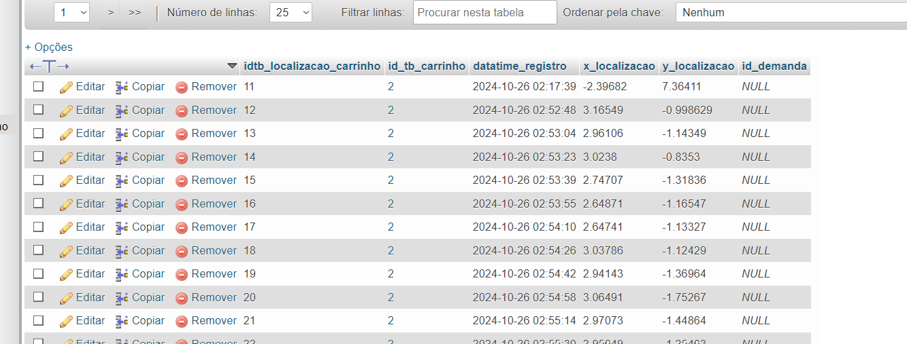

- **Tempo Médio de Resposta**: 0.50 segundos para coleta e envio dos dados.
- **Tempo Máximo Observado**: 1.5 segundos.

#### Discussão dos Resultados
O tempo de resposta médio está dentro do esperado para atualizações periódicas. No entanto, houve instâncias onde o tempo excedeu o ideal, possivelmente devido à qualidade da conexão WiFi. Infelizmente resultados muito fora dos esperados também são considerados o que dificulta o sistema da aplicação, como se algum objeto massivo passase perto o que faz os paramatros de RSSI sairem do controle.

#### Soluções Futuras
- Otimizar o algoritmo de coleta e envio de dados para reduzir a latência.
- Implementar uma estrutura de buffer para envio em lotes caso o tempo de resposta precise ser constante.
- Fazer média dos valores para exibir e desconsiderar valores fora da curva.

