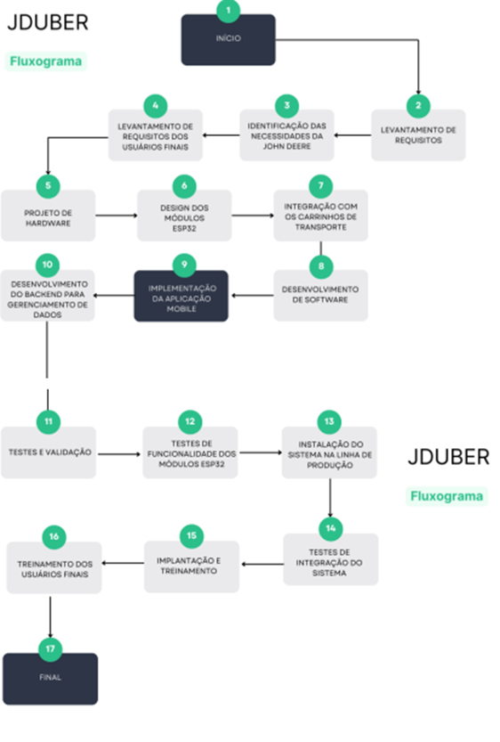
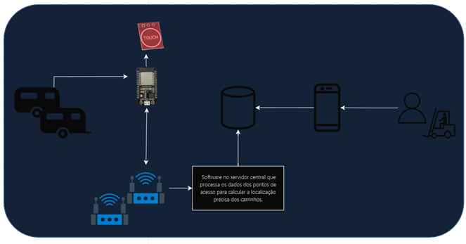
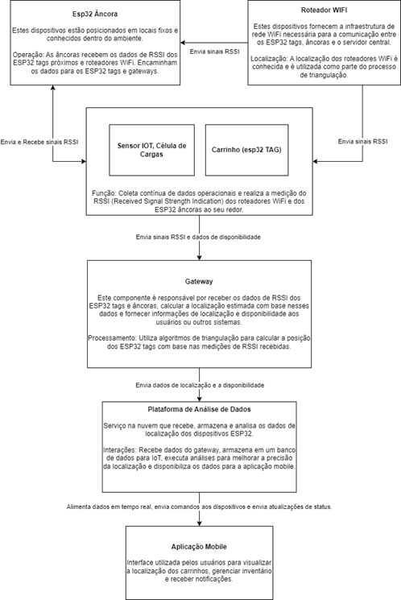

# Introdução

Este projeto foi desenvolvido para resolver a necessidade da **John Deere** de melhorar o gerenciamento e a localização de carrinhos em suas plataformas industriais. A principal dor enfrentada é a falta de controle preciso em tempo real da posição dos carrinhos, resultando em ineficiências operacionais, atrasos nas entregas de componentes e, consequentemente, aumento nos custos.

O objetivo deste projeto é implementar uma solução baseada em **IoT**, utilizando dispositivos **ESP32**, que permitirá a localização precisa dos carrinhos dentro das instalações. Essa solução busca otimizar o fluxo logístico, melhorar o gerenciamento de recursos e garantir que os carrinhos possam ser localizados de forma rápida e eficiente por meio de uma interface mobile.

# Desenvolvimento

O projeto de gestão de fluxo de transporte de peças em um ambiente de produção será desenvolvido em seis etapas. Na primeira etapa, será feito o planejamento e definição dos requisitos do sistema, especificando as funcionalidades, componentes de hardware e software necessários, e estabelecendo critérios de sucesso e metas do projeto. Um cronograma detalhado será criado, definindo as responsabilidades da equipe e alocando recursos e orçamento.   
Na segunda etapa, será realizado o design de hardware, incluindo a seleção de componentes como o modelo do ESP32, sensores de disponibilidade, LEDs e resistores, além do sistema de alimentação. Um esquema eletrônico detalhado será criado. A terceira etapa envolve o design de software, com desenvolvimento do firmware para o ESP32, configuração inicial, leitura dos sensores e comunicação Wi-Fi com o servidor central. Também será desenvolvida a aplicação mobile, focando no design da interface do usuário, implementação de funcionalidades principais e testes de usabilidade, além da configuração do servidor central e implementação da API de comunicação.  
A quarta etapa é a prototipagem e integração, onde será montado o protótipo de hardware do carrinho de transporte, seguido por testes iniciais de conexão e funcionamento dos componentes. A integração de hardware e software será realizada, com testes de comunicação e integração entre a aplicação mobile e o servidor central, além de testes dos algoritmos de triangulação Wi-Fi para localização dos carrinhos. Na quinta etapa, serão realizados testes e validação, incluindo testes individuais de cada componente, testes de integração em ambiente controlado, testes de campo no ambiente de produção real e ajustes baseados no feedback dos operadores.  
Na sexta e última etapa, será feita a documentação e treinamento, incluindo a criação de documentação detalhada para hardware e software, manuais de usuário para a aplicação mobile e procedimentos de manutenção do sistema. Esta abordagem estruturada garantirá que todas as fases do projeto sejam cuidadosamente planejadas, implementadas e testadas, assegurando o sucesso e a eficácia do sistema proposto.

## Arquitetura

A solução proposta é baseada em uma arquitetura IoT que envolve os seguintes elementos:

- **ESP32 Tags**: Dispositivos móveis que são colocados nos carrinhos. Eles enviam sinais Wi-Fi e Bluetooth para calcular a posição.
- **ESP32 Âncoras**: Dispositivos fixos que servem como pontos de referência para calcular a localização dos ESP32 Tags por meio de triangulação de sinais.
- **Roteadores Wi-Fi**: Conectam os dispositivos e transmitem os dados coletados para o servidor.
- **Gateway (ESP32 ou servidor dedicado)**: Coleta os dados dos ESP32 Tags e Âncoras, e os envia para a plataforma de análise na nuvem.
- **Plataforma de Análise de Dados (Nuvem)**: Armazena e processa os dados de localização, fornecendo resultados em tempo real.
- **Aplicação Mobile**: Interface gráfica onde os operadores podem visualizar a localização dos carrinhos e gerenciar suas rotas de entrega.
- 

## Funcionamento e Tecnologias Envolvidas

- **ESP32**: Utiliza triangulação de sinais Wi-Fi e Bluetooth para calcular a localização. A biblioteca **Arduino** foi utilizada para a programação desses dispositivos.
- **Wi-Fi**: Utilizado para conectar os dispositivos e transferir os dados para o gateway.
- **Nuvem**: Os dados são enviados para uma plataforma em nuvem que utiliza **banco de dados MySQL** para armazenar as localizações dos carrinhos.
- **Mapbox GL JS**: Foi utilizado para visualização das localizações dos carrinhos em uma planta interna, permitindo a delimitação de caminhos e pontos de referência.
- **Mobile App**: Desenvolvido em **Java**, permite ao usuário monitorar a localização dos carrinhos e gerenciar suas rotas.

### Resultados Esperados

- **Precisão**: Espera-se que o sistema tenha uma precisão de localização que permita rastrear os carrinhos dentro da planta industrial com margem de erro reduzida.
- **Monitoramento em Tempo Real**: A aplicação deve fornecer atualizações em tempo real da posição dos carrinhos, melhorando o fluxo de trabalho.
- **Eficiência Operacional**: Redução no tempo de busca pelos carrinhos, resultando em maior eficiência e produtividade nas operações.

# Resultados

O projeto entregou uma aplicação funcional que realiza a localização dos carrinhos dentro da planta da John Deere. A seguir estão os principais resultados:

1. **Localização em Tempo Real**: A interface mobile exibe a posição dos carrinhos em um mapa, com atualizações em tempo real.

   

2. **Gerenciamento de Rotas**: A aplicação permite que o operador visualize as rotas de coleta e entrega diretamente pela interface, simplificando o processo logístico.

   

3. **Precisão de Localização**: Testes realizados indicaram que o sistema conseguiu atingir a precisão esperada, com um erro máximo de X metros.

   

Esses resultados mostram que a solução IoT foi bem-sucedida em atender aos objetivos do projeto, otimizando o processo de gerenciamento dos carrinhos na plataforma industrial da John Deere.

